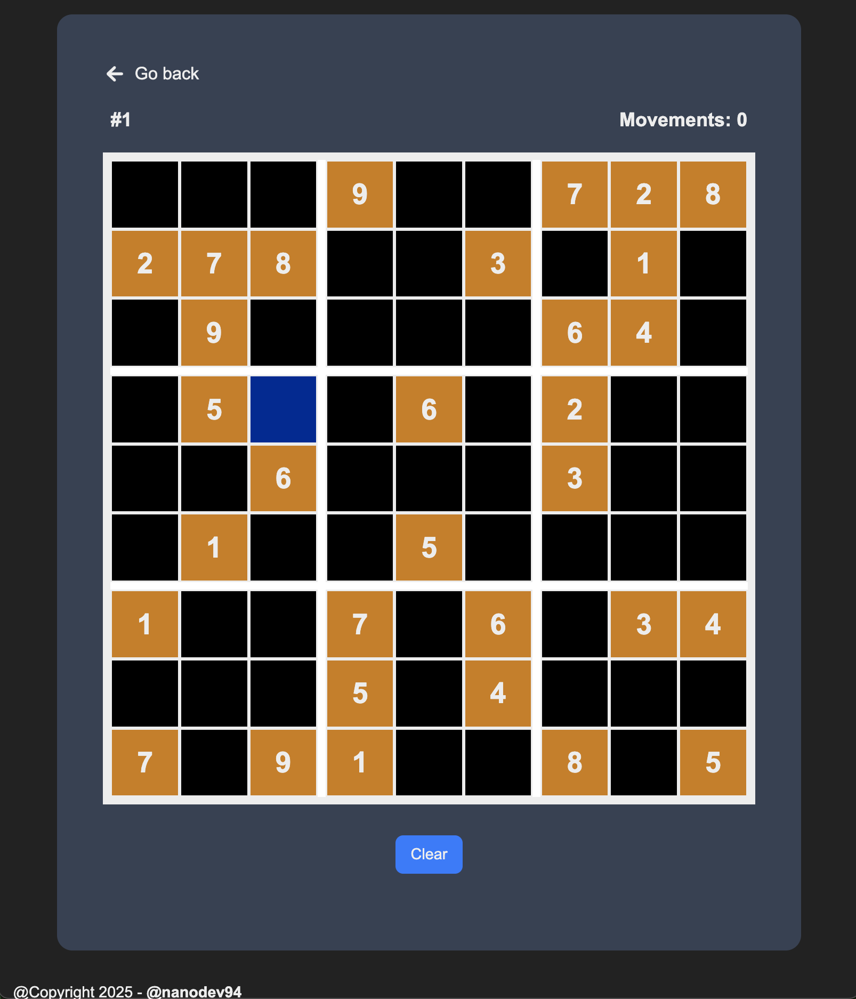
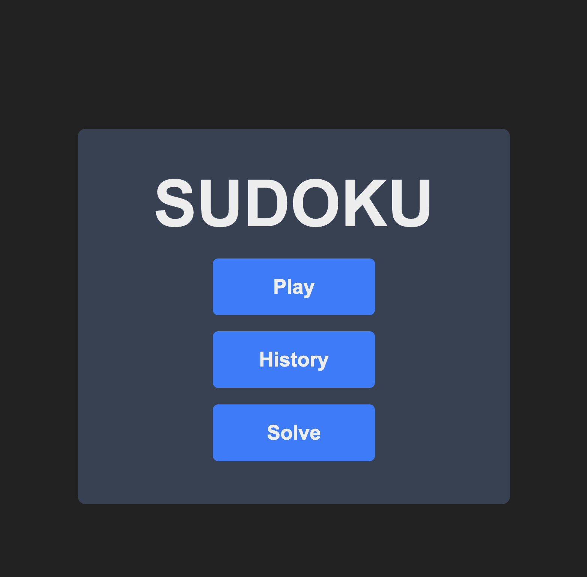
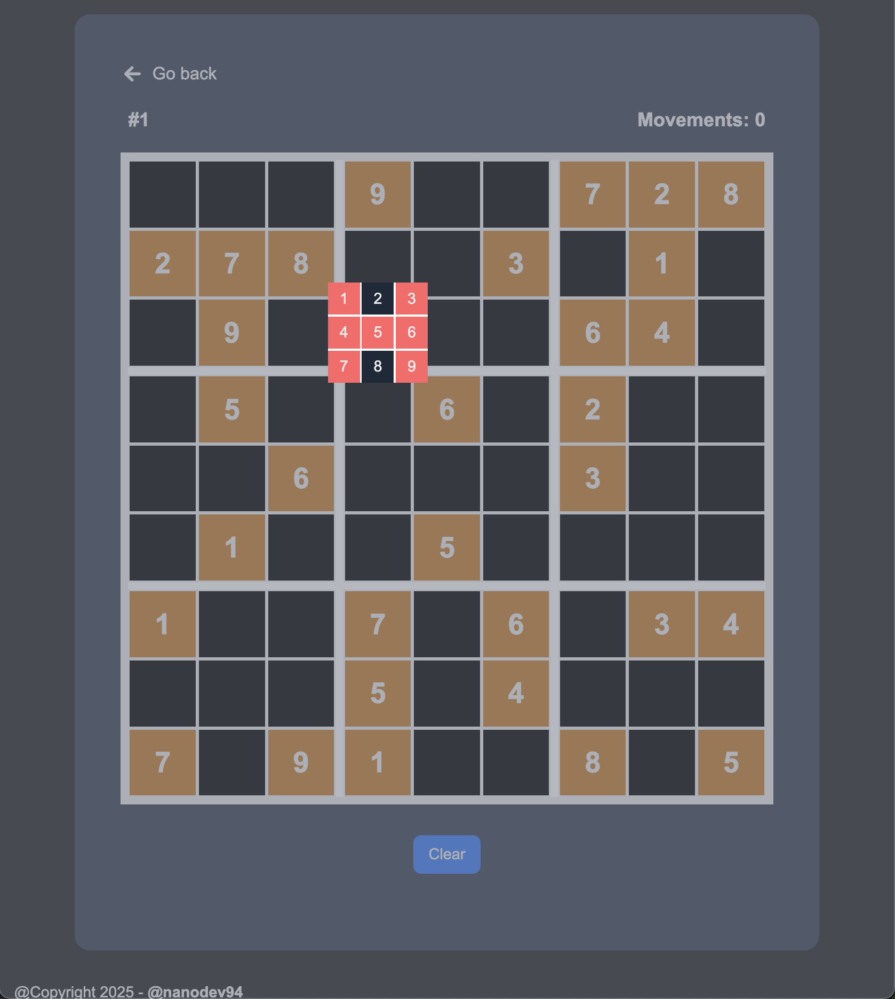
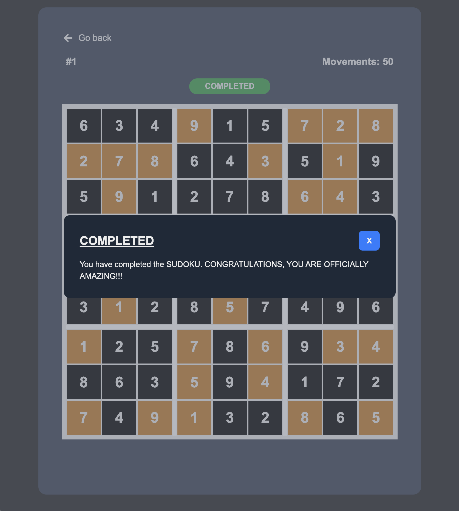
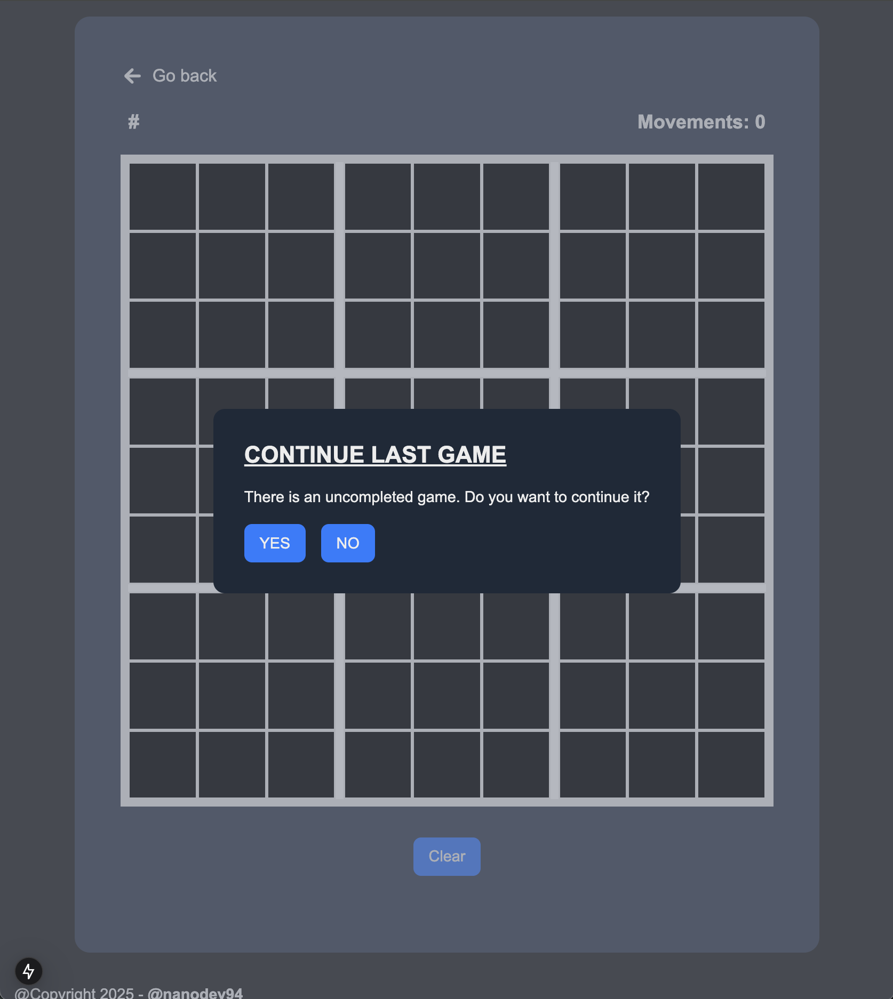
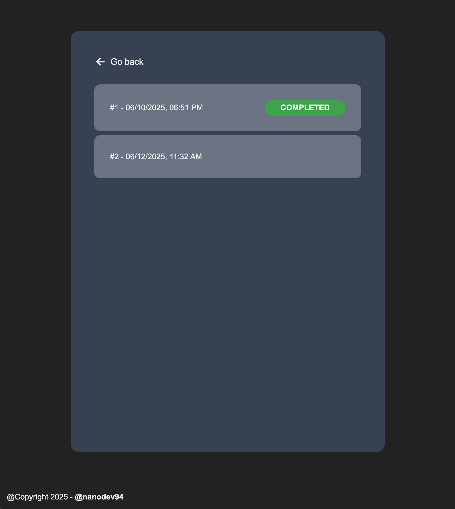
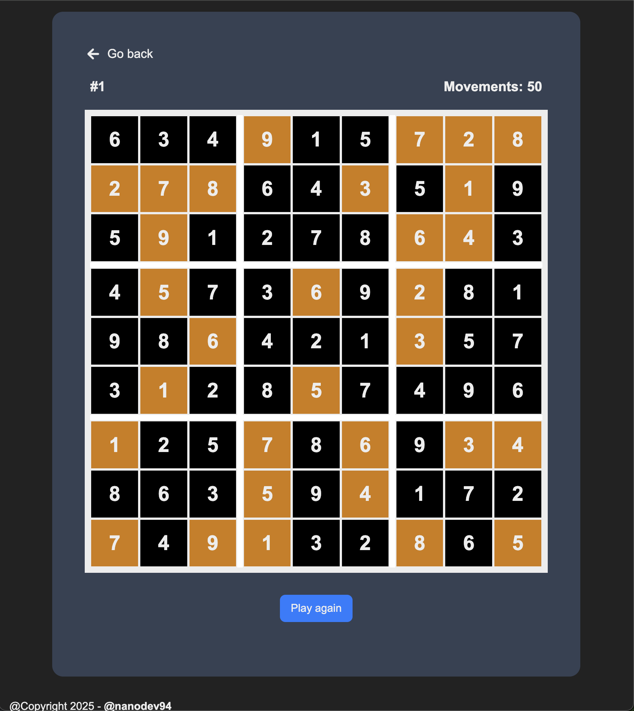
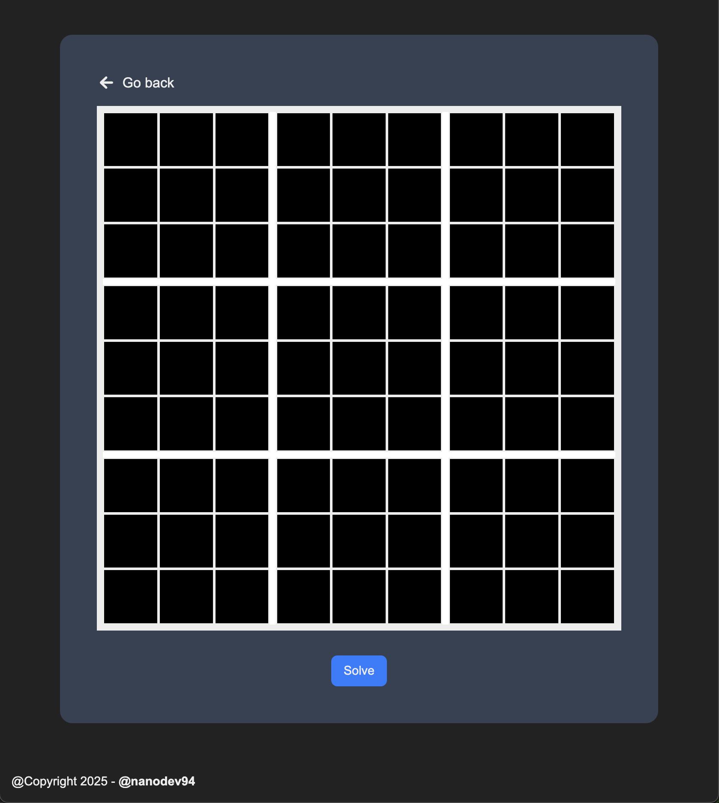
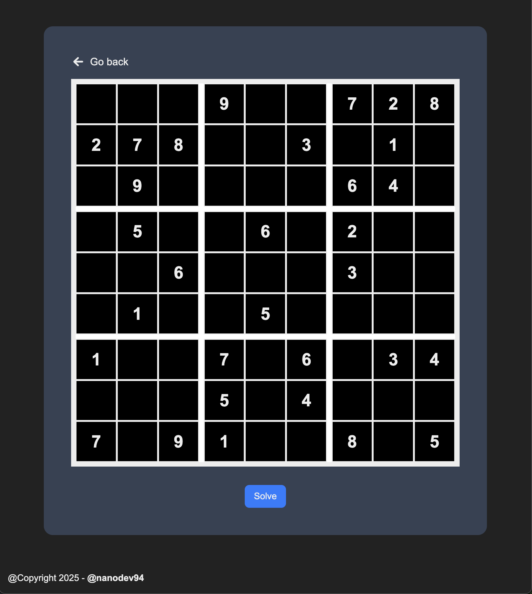
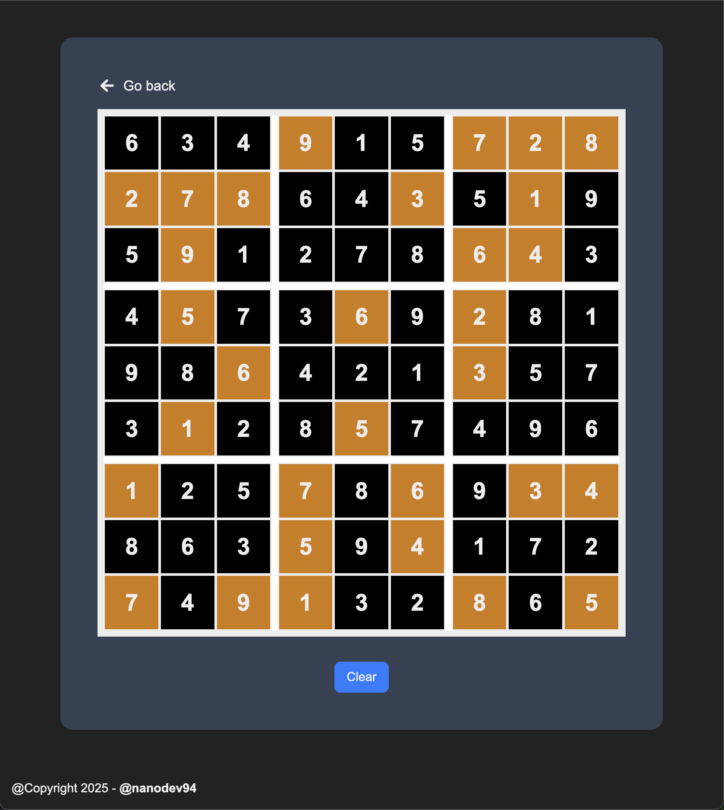

# SUDOKU

  

As a sudoku game fan, I want to create an application to play and have fun. SUDOKU is an app in which you can play a random game, save your games in your browser, view your game's history and solve your own SUDOKUS.

To implement this app, I have used the following dependencies:

- **Eslint** (Linter)
- **Prettier** (Formatter)
- **Typescript** (Type checks)
- **TailwindCSS** (CSS framework)
- **NextJs** (React Framework)
- **Next-intl** (Internationalization)
- **React-icons** (Icons)
- **Zustand** (Global state management)

When you enter to the app, you can see the following main menu:

  

If you choose "Play" option, a random game starts:

  

You can see a sudoku board with initial numbers in orange color and they are not editable. When you click in one empty cell, a value selector is shown at cell position:

  

Not valid values for that cell has a red background and you can not select them. You only can select valid numbers based on sudoku rules.

If you are in a situation in which you do not know how to continue, you can click "Clear" button at bottom of board and the game will be reset.

Whe you complete a game, a modal is shown with a victory message:

  

Also, if you have to go and last game is not completed, when you enter to "Play" option, a modal message appears to ask you if you want to continue last game or want to init a new one:

  

On the other hand, if you choose "History" in main menu, you will see a list of all your games:

  

If you click one of them, you can see the board of that game (not edit it):

  

If you click "Play again" button, you can play a new game with the same initial numbers.

Finally, the last added functionality to the app, SOLVE. You can access it by clicking the "Solve" button in main menu:

  

You can introduce your initial numbers:

  

When you finish, you can click "Solve" button at bottom of board and solution is shown:

  

